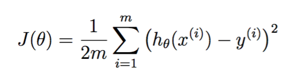
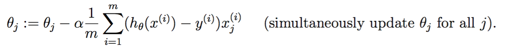
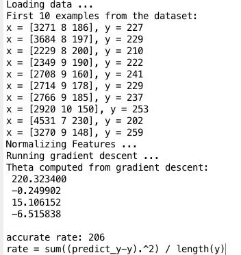
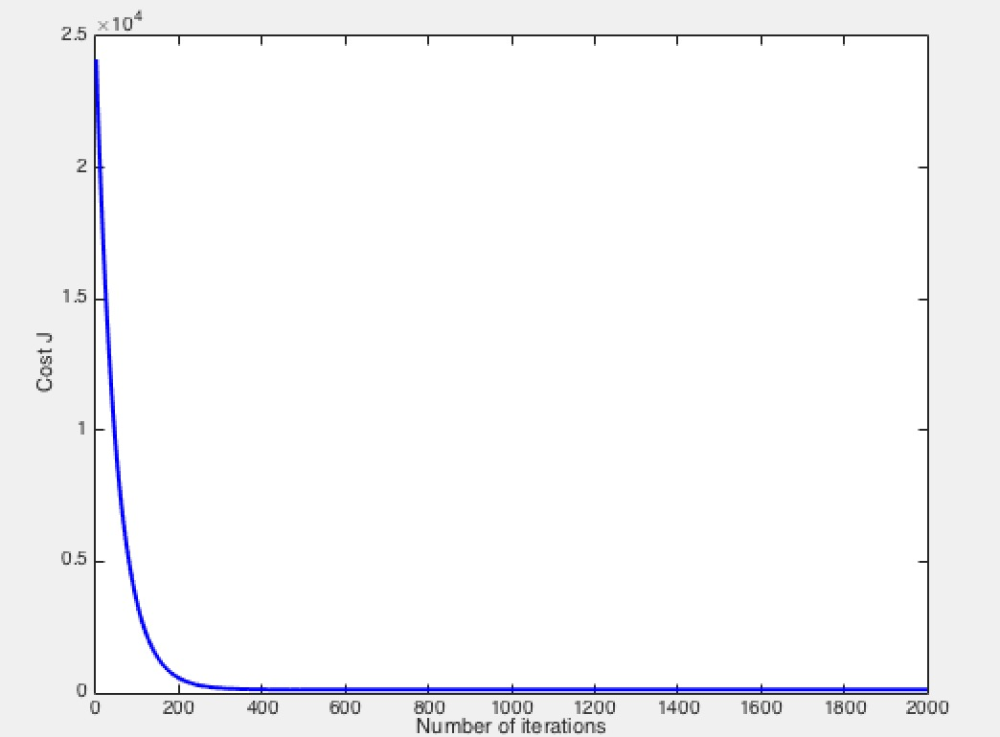

# Assignment 1, Liner Regression

**2111512017 李疆**

- 数据读取(Load Data)
- 数据归一化(features Normalize)
- 训练梯度下降 (Training - Gradient Descent)
- 结果评估(Estimate the model)

## 数据读取(Load Data)
**OSX系统下，matlab实现**

选取肺活量，短跑，跳远作为特征，拟合估计长跑成绩。

```matlab
[digit, txt, raw] = xlsread('psydata.xlsx'); %?表格已处理过，把跑步成绩文本信息，转化为数字，添加新列保存，便于读取数据。男女长跑成绩都化为800米跑步时间。

%选取肺活量，短跑，跳远作为特征arr_X，拟合长跑成绩
trainSize = 2000; % Training sample size
testSize = size(digit,1) - trainSize;
X = digit(1:trainSize, 4:6);
Y = digit(1:trainSize, 12);
```

### 数据归一化(eatures Normalize)

`function [ X_normal, mu, sigma ] = featureNormalize( X )`

求出样本均值mu和方差sigma，处理输入`x(i) = (x(i) - mu ) / sigma `.

添加一列x(0) = 0;

### 训练梯度下降 (Training - Gradient Descent)

设置学习率 $$\alpha = 0.01$$, 迭代次数 `num_iters = 2000`

- 代价损失函数 cost function

  `J = sum((X * theta - Y) .^ 2) / ( 2 * m );`

  


- 梯度下降，每次迭代更新$$\theta$$ 向量，并记录代价函数值$$J(\theta)$$



```python
theta = theta - (alpha / m ) * X' * (X * theta - Y);
J_history(iter) = computeCostMulti(X, Y, theta);  %save the cost J in every iteration
```


### 结果评估(Estimate the model)

- 结果输出如下



- 由下图可知，模型收敛



- 对测试数据评估误差 

  令$$testError = \frac{1}{m} \sum_{i=1}^{m}(h_\theta (x^i) - y^i )^2$$

  `acc_rate = sum( (X_test * theta - Y_test) .^ 2 ) / m;`

  得到$$testError = 206$$ （男女长跑成绩统一表示为 秒／800米 ）

  ​