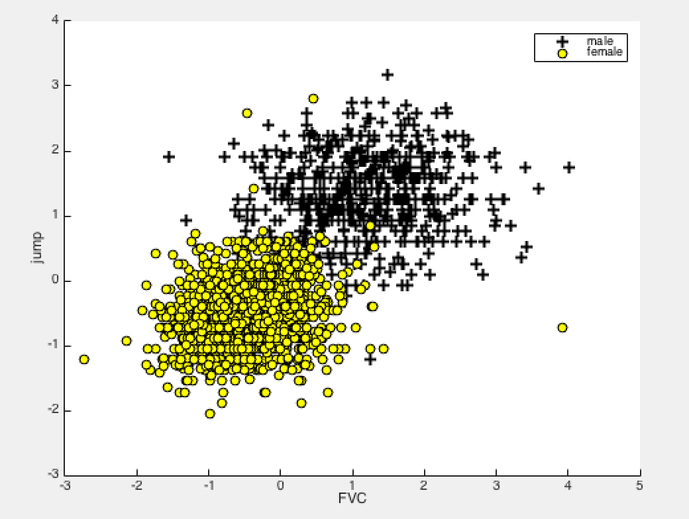

# Assignment2, Logical Regression

- Load Data
- Plot Data
- Normalize features and preprocess label
- Compute Cost and Gradient Descent
- plot costFunction history, accuracy history with xlabel 'iteration'


### Load Data

- 选取肺活量和跳远，拟合性别;训练样本数设置为2000

```
[digit, txt, raw] = xlsread('psydata.xlsx');  %load data

%select tow features, FVC and Jump. the Label is gender.

featuresRange = [4 6];
trainSize = 2000;   %size of training sample
X = digit(1:trainSize, featuresRange);
```
- 原始数据性别表示为1（男），2（女），为了分类处理方便，将2（女）转化为0（女）
  `Y( find(Y==2) ) = 0;`

### Plotting Data


### Compute Cost and Gradient Descent
每次迭代，计算并记录costFucton和准确率，同时求costFunction其偏导，既而梯度下降修改$$\theta$$ 。
  
`J = -1 * sum( Y .* log( sigmoid(X * theta) ) + (1 - Y) .* log(1 - sigmoid(X * theta) ) ) / m;
`  
  
```
for i = 1:num_iters
    [J_cur grad_cur] = costFunction(X, Y, theta);
    J_history(i) = J_cur;
    p = predict(theta, X);
    acc_history(i) = mean(double(p == Y)) * 100;
    theta = theta - alpha * grad_cur;
end
```
### Plot J_history and Accuracy_history


### compute Test Data Accuracy Rate

- 计算测试集的准确率，结果如下


​	**Test Data Accuracy: 97.845601**


